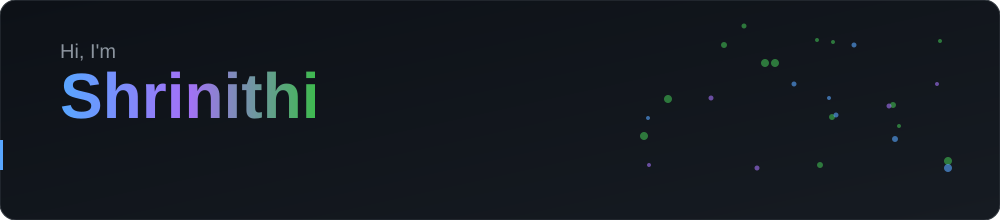
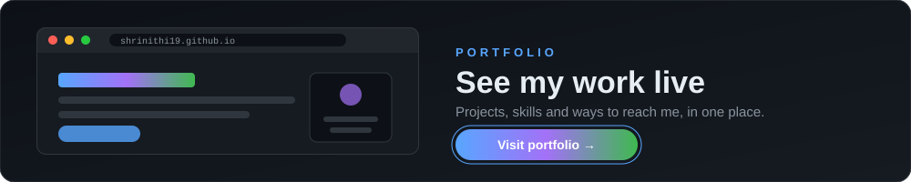
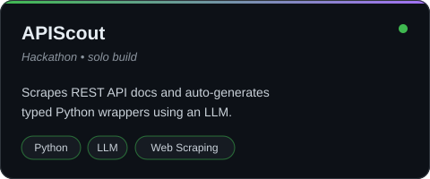
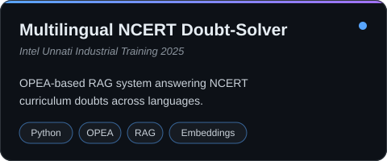
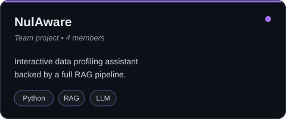
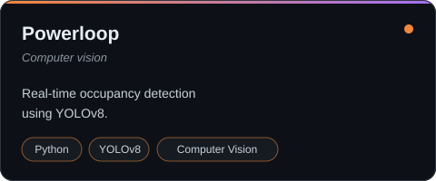
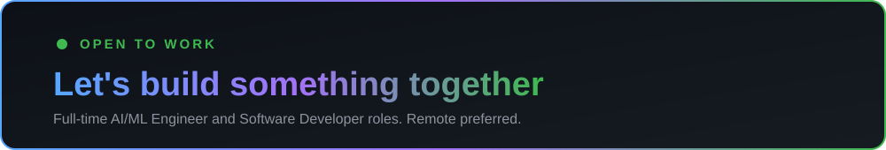

<!-- Repo name must be exactly: shrinithi19/shrinithi19 (public). Keep the assets/ folder next to this file. -->

<div align="center">



<br/>

<!-- <a href="https://shrinithi19.github.io/"></a> -->
<a href="https://www.linkedin.com/in/shrinithi-nagarajan/"></a>
<a href="https://leetcode.com/Shrinithi_N"></a>


</div>

<h2>👋 About Me</h2>

Final-year Computer Science student (Data Science & AI/ML) at Sri Shakthi Institute of Engineering and Technology, graduating 2026. I build applied GenAI systems: RAG architectures, embedding model benchmarking and retrieval pipeline tuning. Computer vision is my second lane.

<blockquote>🎯 <b>Open to:</b> full-time AI/ML Engineer or Software Developer roles (remote preferred)</blockquote>

<div align="center"></div>

<h2>🌐 Portfolio</h2>

<div align="center">
<a href="https://shrinithi19.github.io/"></a>
</div>

<div align="center"></div>

<h2>🚀 Featured Projects</h2>

<table>
<tr>
<td width="50%" valign="top">
<a href="https://github.com/shrinithi19/apiscout"></a>
<!-- <a href="https://github.com/shrinithi19/NCERT-Solver"></a> -->
<br/><b>Impact:</b> Answers NCERT curriculum doubts in multiple languages by retrieving from textbook content
</td>
<td width="50%" valign="top">
<a href="https://github.com/shrinithi19/Nulaware-NL-Profiling"></a>
<br/><b>Impact:</b> Lets you profile a dataset by asking questions in natural language instead of writing code
</td>
</tr>
<tr>
<td width="50%" valign="top">
<a href="https://github.com/shrinithi19/NCERT-Solver"></a>
<br/><b>Impact:</b> Turns REST API docs into a typed Python client automatically, no hand-written wrappers
</td>
<td width="50%" valign="top">

<br/><b>Impact:</b> Detects room occupancy in real time from a camera feed
</td>
</tr>
</table>

<div align="center"></div>

<h2>🛠️ Skills</h2>

<table>
<tr>
<td width="22%" valign="middle"><b>💻 Languages</b></td>
<td>


</td>
</tr>
<tr>
<td width="22%" valign="middle"><b>🔌 Backend & APIs</b></td>
<td>


</td>
</tr>
<tr>
<td width="22%" valign="middle"><b>🗄️ Databases</b></td>
<td>


</td>
</tr>
<tr>
<td width="22%" valign="middle"><b>📚 Python Libraries</b></td>
<td>


</td>
</tr>
<tr>
<td width="22%" valign="middle"><b>🧠 AI/ML Integration</b></td>
<td>


</td>
</tr>
<tr>
<td width="22%" valign="middle"><b>☁️ DevOps & Tools</b></td>
<td>


</td>
</tr>
<tr>
<td width="22%" valign="middle"><b>🎨 Frontend (basic)</b></td>
<td>


</td>
</tr>
</table>

<div align="center"></div>

<h2>📊 GitHub Analytics</h2>

<div align="center">


</div>

<div align="center"></div>

<h2>🎯 Current Focus</h2>

```python
shrinithi = {
    "building":  ["FactoryPulse: predictive maintenance + GenAI copilot"],
    "exploring": ["RAG evaluation", "embedding benchmarks", "retrieval tuning"],
    "seeking":   "AI/ML Engineer / Software Developer (remote)",
}
```

<h2>📫 Let's Connect</h2>

<div align="center">



<br/>

<!-- <a href="https://shrinithi19.github.io/"></a> -->
<a href="https://www.linkedin.com/in/shrinithi-nagarajan/"></a>
<a href="https://leetcode.com/Shrinithi_N"></a>
<a href="mailto:shrinithinagarajan343@gmail.com"></a>

<br/><br/>


</div>
